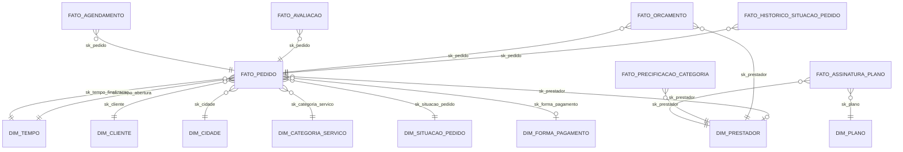
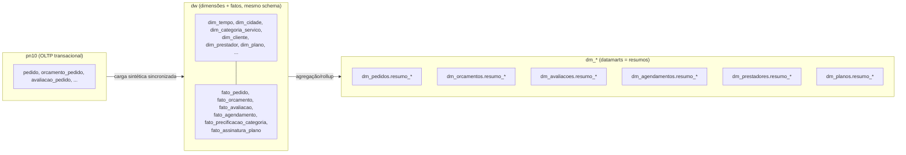

# Data Warehouse — Prestador Nota 10

Modelagem dimensional (estrela) e datamarts por assunto para a plataforma
**Prestador Nota 10** (marketplace de prestadores de serviço), construída a
partir da análise do domínio de negócio do projeto `api` (código-fonte da
API, removido deste workspace após a análise — usado apenas como referência)
e implementada sobre o banco PostgreSQL local `prestadornota10local`
(`jdbc:postgresql://localhost:5433/prestadornota10local`).

## 1. Análise de domínio (fonte: código da API)

A API (`com.opzz.prestadornota10`) implementa um marketplace onde:

- **Usuário** (`usuario`) pode ser `CLIENTE` (contrata serviços) ou
  `PRESTADOR` (presta serviços, associado a um `plano` comercial), sempre
  vinculado a uma `Pessoa` (PF) ou `Empresa` (PJ).
- O **Cliente** cria um **Pedido** (`pedido`) descrevendo o serviço desejado,
  associado a uma ou mais **Categorias de Serviço** (`categoria_servico`,
  hierarquia categoria → subcategoria) e a um endereço de atendimento
  (cidade/geolocalização).
- **Prestadores** enviam **Orçamentos** (`orcamento_pedido`) para o pedido; o
  cliente aceita um deles (`codigo_orcamento_selecionado`).
- O pedido evolui por um fluxo de situações (enum `SituacaoPedido`):
  `AGUARDANDO_ORCAMENTO → AGUARDANDO_AGENDAMENTO → AGUARDANDO_ATENDIMENTO →
  FINALIZADO_AGUARDANDO_AVALIACAO → FINALIZADO`, podendo ser `CANCELADO` em
  qualquer etapa. Cada transição é registrada em `historico_situacao_pedido`.
- Após o orçamento ser aceito, é criado um **Agendamento** (`agendamento`),
  vinculado à **Agenda** do prestador.
- Ao finalizar o serviço, o cliente registra uma **Avaliação**
  (`avaliacao_pedido`, nota 1–5), 1:1 com o pedido.
- Prestadores possuem **precificação por categoria**
  (`categoria_servico_prestador`) e assinam um **Plano** comercial
  (`plano`, limite de clientes/mês), controlado por integrações de
  pagamento (Hotmart/Monetizze/Eduzz).
- Existe também um fluxo alternativo de **Pedido Fixo** (preço fechado,
  prestadores concorrem por convite) — fora do escopo deste DW (ver seção 6).

Enums de negócio mapeados para dimensões: `SituacaoPedido`,
`SituacaoOrcamento`, `FormaPagamento` (`PIX`, `CARTAO`, `DINHEIRO`).

No ambiente local, as tabelas transacionais (`pedido`, `orcamento_pedido`,
`avaliacao_pedido`, `agendamento`, `pessoa`, `empresa`, `usuario`, `plano`)
estavam **vazias** — só havia dados de referência (cidade, estado,
categoria_servico, bancos, permissões). Por isso o DW foi **populado com
dados sintéticos**, gerados via PL/pgSQL respeitando as regras de negócio
acima (fluxo de situações, relação 1 pedido → N orçamentos → 1 selecionado,
1 pedido → 0/1 avaliação, etc.), enquanto os dados mestres reais
(cidade/estado/categoria_servico) foram reaproveitados como estão.

O mesmo conjunto sintético (mesmos nomes, cidades, situações, valores,
notas e datas) também foi replicado nas tabelas **transacionais do OLTP**
(`pn10.pessoa/empresa/contato/endereco/usuario/agenda/pedido/
orcamento_pedido/historico_situacao_pedido/agendamento/avaliacao_pedido/
plano/categoria_servico_prestador`), para que a API e o DW fiquem
sincronizados — ver `01_oltp_ddl.sql` e `02_oltp_carga.sql` na seção 4.

## 2. Arquitetura do DW

O pipeline segue três camadas, nesta ordem:

```
Banco transacional (OLTP)  →  DW (dimensões + fatos, mesmo schema)  →  Datamart (resumos do fato)
```

**Mudança de arquitetura em relação à primeira versão:** antes, o schema
`dw` continha só as dimensões conformadas e cada datamart (`dm_*`) guardava
sua própria cópia das tabelas fato. Agora as tabelas **fato ficam no mesmo
schema `dw` das dimensões** (esquema estrela convencional, único), e os
schemas `dm_*` passam a conter apenas **tabelas de resumo/agregação**
(rollups) construídas a partir dos fatos do `dw` — não há mais grão fino
nos datamarts.

| Schema | Papel | Conteúdo |
|---|---|---|
| `dw` | Data Warehouse | Todas as dimensões (`dim_*`) e todos os fatos (`fato_*`) |
| `dm_pedidos` | Datamart | Resumos de `dw.fato_pedido` |
| `dm_orcamentos` | Datamart | Resumos de `dw.fato_orcamento` |
| `dm_avaliacoes` | Datamart | Resumos de `dw.fato_avaliacao` |
| `dm_agendamentos` | Datamart | Resumos de `dw.fato_agendamento` |
| `dm_prestadores` | Datamart | Resumos de `dw.fato_precificacao_categoria` / `dw.dim_prestador` |
| `dm_planos` | Datamart | Resumos de `dw.fato_assinatura_plano` |

### Diagrama do DW (fato + dimensões no mesmo schema)



### Diagrama geral do pipeline



## 3. Grão das tabelas fato (schema `dw`)

| Tabela | Grão |
|---|---|
| `dw.fato_pedido` | 1 linha por pedido |
| `dw.fato_historico_situacao_pedido` | 1 linha por transição de situação do pedido |
| `dw.fato_orcamento` | 1 linha por orçamento enviado por um prestador |
| `dw.fato_avaliacao` | 1 linha por avaliação de pedido finalizado |
| `dw.fato_agendamento` | 1 linha por agendamento de atendimento |
| `dw.fato_precificacao_categoria` | 1 linha por (prestador, categoria de serviço atendida) |
| `dw.fato_assinatura_plano` | 1 linha por prestador (snapshot do plano vigente) |

### Grão das tabelas de resumo (datamarts)

| Tabela | Grão |
|---|---|
| `dm_pedidos.resumo_pedido_mes_categoria` | 1 linha por (ano, mês, categoria de serviço, situação) |
| `dm_pedidos.resumo_pedido_regiao` | 1 linha por região geográfica |
| `dm_orcamentos.resumo_orcamento_prestador` | 1 linha por prestador |
| `dm_orcamentos.resumo_orcamento_categoria` | 1 linha por categoria de serviço |
| `dm_avaliacoes.resumo_avaliacao_categoria` | 1 linha por categoria de serviço |
| `dm_avaliacoes.resumo_avaliacao_prestador` | 1 linha por prestador |
| `dm_agendamentos.resumo_agendamento_mes` | 1 linha por (ano, mês) |
| `dm_agendamentos.resumo_agendamento_prestador` | 1 linha por prestador |
| `dm_prestadores.resumo_prestador_categoria` | 1 linha por categoria de serviço |
| `dm_prestadores.resumo_prestador_regiao` | 1 linha por região geográfica |
| `dm_planos.resumo_plano` | 1 linha por plano comercial |

## 4. Scripts (executar em ordem)

| Ordem | Arquivo | Camada | Conteúdo |
|---|---|---|---|
| 1 | `01_oltp_ddl.sql` | Banco transacional | DDL completo do OLTP (todas as migrações Flyway `V001`–`V059` + dados dev); cria o schema `pn10` já no início do script (`CREATE SCHEMA pn10` + `SET search_path`) |
| 2 | `02_oltp_carga.sql` | Banco transacional | Carga sintética do OLTP em **INSERTs SQL puros** (pessoa/empresa/contato/endereco/usuario/agenda/pedido/orcamento_pedido/historico_situacao_pedido/agendamento/avaliacao_pedido/plano/categoria_servico_prestador) |
| 3 | `03_dw_ddl.sql` | DW | Cria o schema único `dw` com **todas as dimensões e todos os fatos juntos** |
| 4 | `04_dw_carga.sql` | DW | Popula as dimensões (dados mestre reais + sintéticos) e os fatos (pedido, histórico, orçamento, avaliação, agendamento, precificação, assinatura) — sintéticos, respeitando o fluxo de `SituacaoPedido`/`SituacaoOrcamento` |
| 5 | `05_datamart_ddl.sql` | Datamart | Cria os 6 schemas `dm_*`, cada um só com tabelas de **resumo/agregação** (2 por assunto) |
| 6 | `06_datamart_carga.sql` | Datamart | ETL de agregação: `INSERT INTO ... SELECT ... GROUP BY` a partir de `dw.fato_*`/`dw.dim_*` |

### Como executar

Os scripts são executados manualmente, um a um, na ordem 1→2→3→4→5→6 (não há
script único tipo `run_all.sh` — isso é intencional, para quem for rodar
acompanhar cada etapa):

```bash
cd dw
export PGHOST=localhost PGPORT=5433 PGUSER=postgres PGPASSWORD=postgres PGDATABASE=prestadornota10local
psql -v ON_ERROR_STOP=1 -f 01_oltp_ddl.sql
psql -v ON_ERROR_STOP=1 -f 02_oltp_carga.sql
psql -v ON_ERROR_STOP=1 -f 03_dw_ddl.sql
psql -v ON_ERROR_STOP=1 -f 04_dw_carga.sql
psql -v ON_ERROR_STOP=1 -f 05_datamart_ddl.sql
psql -v ON_ERROR_STOP=1 -f 06_datamart_carga.sql
```

Os scripts de DDL (`01`, `03`, `05`) são idempotentes: recriam suas
estruturas do zero (`DROP TABLE`/`DROP SCHEMA ... CASCADE`) antes de
popular novamente.

## 5. Exemplos de consultas analíticas

```sql
-- Direto no DW (join fato + dimensões)
select sit.situacao, count(*)
from dw.fato_pedido fp
join dw.dim_situacao_pedido sit on sit.sk_situacao_pedido = fp.sk_situacao_pedido
group by sit.situacao order by 2 desc;

-- Direto no datamart (já é um resumo, sem necessidade de join)
select * from dm_pedidos.resumo_pedido_regiao order by qtd_pedidos desc;

select * from dm_avaliacoes.resumo_avaliacao_categoria order by nota_media desc;

select * from dm_planos.resumo_plano order by qtd_prestadores desc;
```

## 6. Simplificações e extensões futuras

- **Pedido Fixo / Convite** (`pedido_fixo`, `convite_pedido_fixo`) não foi
  modelado no DW — mesmo padrão de `fato_pedido` pode ser replicado.
- `qtd_categorias_servico` é um atributo degenerado (contagem) em
  `dw.fato_pedido`; o relacionamento N:N pedido↔categoria não foi
  modelado como bridge table para simplificar o grão do fato.
- `dw.dim_plano` é sintética (tabela `pn10.plano` estava vazia no OLTP).
- `dw.fato_assinatura_plano` é um snapshot (1 linha por prestador); para
  histórico de trocas de plano seria necessário SCD tipo 2.
- Os datamarts (`dm_*`) guardam apenas os resumos gerados em
  `06_datamart_carga.sql`; para novos recortes analíticos, basta adicionar
  uma tabela de resumo e seu `INSERT ... SELECT ... GROUP BY` a partir do
  `dw`, sem alterar o DW.
- Próximas etapas do pipeline (fora do escopo deste diretório): regras de
  associação e modelos de ensemble sobre os dados do DW/datamart.

## 7. Fluxo de contribuição

A branch `main` **não deve receber push direto** — todas as mudanças devem
ser propostas em uma branch separada e integradas via Pull Request
(merge). Esta é uma convenção de equipe (o GitHub bloqueia a proteção
técnica de branch em repositórios privados fora do plano Pro); ao tornar o
repositório público ou migrar para um plano pago, aplicar a proteção via
`gh api repos/<owner>/<repo>/branches/main/protection` (ou Rulesets).

## 8. Metabase (visualização dos datamarts)

O diretório [`metabase/`](metabase) sobe um container do Metabase (via
`docker compose`) já conectado ao Postgres do projeto e expõe, em
`metabase/views/`, uma view `vw_*` para cada tabela de resumo dos 6
datamarts — são essas views que aparecem no catálogo de dados do
Metabase para montar perguntas/dashboards. Ver
[`metabase/README.md`](metabase/README.md) para instruções de uso.

