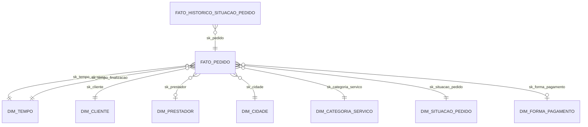
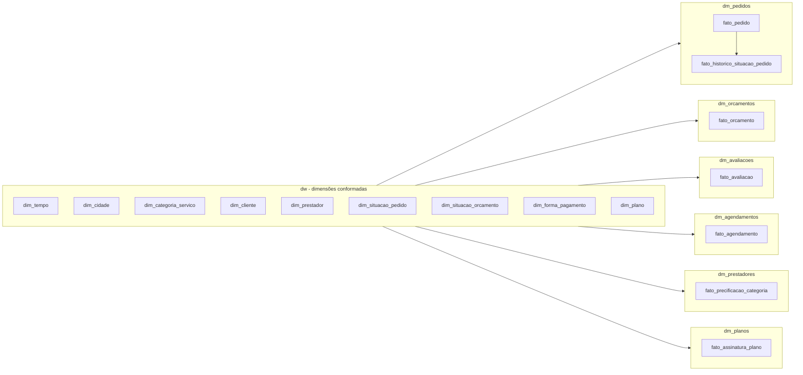

# Data Warehouse — Prestador Nota 10

Modelagem dimensional (estrela) e datamarts por assunto para a plataforma
**Prestador Nota 10** (marketplace de prestadores de serviço), construída a
partir da análise do domínio de negócio do projeto `api` (código-fonte da
API, removido deste workspace após a análise — usado apenas como referência)
e implementada sobre o banco PostgreSQL local `prestadornota10local`
(`jdbc:postgresql://localhost:5433/prestadornota10local`).

## 1. Análise de domínio (fonte: código da API)

A API (`com.opzz.prestadornota10`) implementa um marketplace onde:

- **Usuário** (`usuario`) pode ser `CLIENTE` (contrata serviços) ou
  `PRESTADOR` (presta serviços, associado a um `plano` comercial), sempre
  vinculado a uma `Pessoa` (PF) ou `Empresa` (PJ).
- O **Cliente** cria um **Pedido** (`pedido`) descrevendo o serviço desejado,
  associado a uma ou mais **Categorias de Serviço** (`categoria_servico`,
  hierarquia categoria → subcategoria) e a um endereço de atendimento
  (cidade/geolocalização).
- **Prestadores** enviam **Orçamentos** (`orcamento_pedido`) para o pedido; o
  cliente aceita um deles (`codigo_orcamento_selecionado`).
- O pedido evolui por um fluxo de situações (enum `SituacaoPedido`):
  `AGUARDANDO_ORCAMENTO → AGUARDANDO_AGENDAMENTO → AGUARDANDO_ATENDIMENTO →
  FINALIZADO_AGUARDANDO_AVALIACAO → FINALIZADO`, podendo ser `CANCELADO` em
  qualquer etapa. Cada transição é registrada em `historico_situacao_pedido`.
- Após o orçamento ser aceito, é criado um **Agendamento** (`agendamento`),
  vinculado à **Agenda** do prestador.
- Ao finalizar o serviço, o cliente registra uma **Avaliação**
  (`avaliacao_pedido`, nota 1–5), 1:1 com o pedido.
- Prestadores possuem **precificação por categoria**
  (`categoria_servico_prestador`) e assinam um **Plano** comercial
  (`plano`, limite de clientes/mês), controlado por integrações de
  pagamento (Hotmart/Monetizze/Eduzz).
- Existe também um fluxo alternativo de **Pedido Fixo** (preço fechado,
  prestadores concorrem por convite) — fora do escopo deste DW (ver seção 6).

Enums de negócio mapeados para dimensões: `SituacaoPedido`,
`SituacaoOrcamento`, `FormaPagamento` (`PIX`, `CARTAO`, `DINHEIRO`).

No ambiente local, as tabelas transacionais (`pedido`, `orcamento_pedido`,
`avaliacao_pedido`, `agendamento`, `pessoa`, `empresa`, `usuario`, `plano`)
estavam **vazias** — só havia dados de referência (cidade, estado,
categoria_servico, bancos, permissões). Por isso o DW foi **populado com
dados sintéticos**, gerados via PL/pgSQL respeitando as regras de negócio
acima (fluxo de situações, relação 1 pedido → N orçamentos → 1 selecionado,
1 pedido → 0/1 avaliação, etc.), enquanto os dados mestres reais
(cidade/estado/categoria_servico) foram reaproveitados como estão.

O mesmo conjunto sintético (mesmos nomes, cidades, situações, valores,
notas e datas) também foi replicado nas tabelas **transacionais do OLTP**
(`public.pessoa/empresa/contato/endereco/usuario/agenda/pedido/
orcamento_pedido/historico_situacao_pedido/agendamento/avaliacao_pedido/
plano/categoria_servico_prestador`), para que a API e o DW fiquem
sincronizados — ver `07_popular_oltp_sincronizado.sql` e
`carga_sintetica_oltp.sql` na seção 4.

## 2. Arquitetura do DW

Um schema de **dimensões conformadas** (`dw`) compartilhado por seis
**datamarts por assunto**, cada um em seu próprio schema, contendo apenas as
tabelas fato e views de conveniência:

| Schema | Assunto (datamart) | Fatos |
|---|---|---|
| `dw` | Dimensões conformadas | — |
| `dm_pedidos` | Ciclo de vida operacional dos pedidos | `fato_pedido`, `fato_historico_situacao_pedido` |
| `dm_orcamentos` | Orçamentos/propostas comerciais | `fato_orcamento` |
| `dm_avaliacoes` | Satisfação do cliente / reputação | `fato_avaliacao` |
| `dm_agendamentos` | Agenda e execução do atendimento | `fato_agendamento` |
| `dm_prestadores` | Perfil e precificação dos prestadores | `fato_precificacao_categoria` |
| `dm_planos` | Assinaturas e planos comerciais | `fato_assinatura_plano` |

### Bus Matrix (dimensões conformadas × datamarts)

| Dimensão | dm_pedidos | dm_orcamentos | dm_avaliacoes | dm_agendamentos | dm_prestadores | dm_planos |
|---|:---:|:---:|:---:|:---:|:---:|:---:|
| dim_tempo | X | X | X | X | | X |
| dim_cliente | X | X | X | X | | |
| dim_prestador | X | X | X | X | X | X |
| dim_cidade | X | | X | | X | |
| dim_categoria_servico | X | X | X | | X | |
| dim_situacao_pedido | X | | | | | |
| dim_situacao_orcamento | | X | | | | |
| dim_forma_pagamento | X | | | | | |
| dim_plano | | | | | | X |

### Diagrama do datamart `dm_pedidos` (estrela)



### Diagrama geral dos datamarts



## 3. Grão das tabelas fato

| Tabela | Grão |
|---|---|
| `dm_pedidos.fato_pedido` | 1 linha por pedido |
| `dm_pedidos.fato_historico_situacao_pedido` | 1 linha por transição de situação do pedido |
| `dm_orcamentos.fato_orcamento` | 1 linha por orçamento enviado por um prestador |
| `dm_avaliacoes.fato_avaliacao` | 1 linha por avaliação de pedido finalizado |
| `dm_agendamentos.fato_agendamento` | 1 linha por agendamento de atendimento |
| `dm_prestadores.fato_precificacao_categoria` | 1 linha por (prestador, categoria de serviço atendida) |
| `dm_planos.fato_assinatura_plano` | 1 linha por prestador (snapshot do plano vigente) |

## 4. Scripts (executar em ordem)

| Arquivo | Conteúdo |
|---|---|
| `00_script_unificado_pn10.sql` | DDL completo do OLTP (todas as migrações Flyway `V001`–`V059` + dados dev), usado para (re)criar o schema `public` do zero em um banco novo |
| `00_criar_schemas.sql` | Cria/recria os 7 schemas do DW |
| `01_dimensoes_conformadas.sql` | dim_tempo, dim_cidade, dim_categoria_servico (a partir de dados mestres reais) + dim_situacao_pedido/orcamento, dim_forma_pagamento, dim_plano (a partir dos enums/regras da API) |
| `02_dim_cliente_prestador.sql` | dim_cliente (300) e dim_prestador (120) — **sintéticos** |
| `03_fato_pedido_orcamento_historico.sql` | fato_pedido (800), fato_historico_situacao_pedido, fato_orcamento — **sintéticos**, respeitando o fluxo de `SituacaoPedido`/`SituacaoOrcamento` |
| `04_fato_avaliacao_agendamento.sql` | fato_avaliacao e fato_agendamento derivados do estado de cada pedido |
| `05_fato_prestadores_planos.sql` | fato_precificacao_categoria, fato_assinatura_plano + atualização da reputação em dim_prestador |
| `06_views_analiticas.sql` | Views `vw_*` que já resolvem os joins fato+dimensões de cada datamart |
| `07_popular_oltp_sincronizado.sql` | Popula as tabelas transacionais do **OLTP** (`public.*`) a partir dos dados já gerados no DW, mantendo os dois sincronizados (mesmos clientes, prestadores, pedidos, orçamentos, avaliações, agendamentos e planos) |
| `carga_sintetica_oltp.sql` | **Carga sintética final do OLTP em INSERTs SQL puros** (sem PL/pgSQL, sem `random()`), gerada a partir do resultado do passo 07 — arquivo pronto para versionar/subir ao GitHub e para popular qualquer banco novo já com o DDL aplicado |
| `run_all.sh` | Executa os scripts `00` a `07` acima em ordem via `psql` |

### Como executar

```bash
cd dw
PGHOST=localhost PGPORT=5433 PGUSER=postgres PGPASSWORD=postgres PGDATABASE=prestadornota10local ./run_all.sh
```

Os scripts do DW (`00` a `06`) são idempotentes: o passo `00` recria os
schemas do zero (`DROP SCHEMA ... CASCADE`) antes de popular novamente. O
passo `07` também é idempotente (remove a carga sintética anterior do
`public.*`, preservando os dados mestre e os usuários de sistema
SISTEMA/ADMIN) antes de repopular.

### Carga sintética do OLTP para o GitHub

Para obter (ou regenerar) a carga sintética do OLTP como **INSERTs SQL
puros** — sem depender de PL/pgSQL, laços ou `random()` — em um banco já
com o DDL aplicado (`00_script_unificado_pn10.sql`) e o DW carregado:

1. Rode `07_popular_oltp_sincronizado.sql` (já incluso no `run_all.sh`).
2. Exporte o resultado com a função utilitária `pn10_table_to_inserts`
   (gera `INSERT INTO ... VALUES (...);` genérico por tabela via
   `to_jsonb`, contornando a indisponibilidade de `pg_dump --inserts`
   quando a versão do cliente `pg_dump` não bate com a do servidor).

O arquivo final, **`carga_sintetica_oltp.sql`** (11.148 `INSERT`s + 1.357
`UPDATE`s, ~3,4 MB), foi validado rodando do zero em um banco novo: aplicar
primeiro `00_script_unificado_pn10.sql` e depois `carga_sintetica_oltp.sql`
reproduz exatamente os mesmos 800 pedidos, 2.006 orçamentos, 3.163
transições de histórico, 611 agendamentos e 407 avaliações do DW — sem
nenhuma dependência do schema `dw`/`dm_*`. Os dois `UPDATE`s em massa no
final do arquivo existem porque `pedido.codigo_orcamento_selecionado` e
`pedido.codigo_agendamento` formam uma referência circular com
`orcamento_pedido`/`agendamento` (o pedido é inserido primeiro com essas
duas colunas em `NULL` e só depois vinculado).

## 5. Exemplos de consultas analíticas

```sql
-- Taxa de conversão de pedidos por situação
select situacao, count(*) from dm_pedidos.vw_pedido group by situacao order by 2 desc;

-- Ticket médio por região
select regiao, avg(valor_orcamento_selecionado) from dm_pedidos.vw_pedido group by regiao;

-- Nota média por categoria de serviço
select categoria_servico, avg(nota) from dm_avaliacoes.vw_avaliacao group by categoria_servico order by 2 desc;

-- Prestadores por plano e reputação média
select plano, count(*), avg(avaliacao_media) from dm_planos.vw_assinatura group by plano;
```

## 6. Simplificações e extensões futuras

- **Pedido Fixo / Convite** (`pedido_fixo`, `convite_pedido_fixo`) não foi
  modelado como datamart — mesmo padrão de `dm_pedidos` pode ser replicado.
- `qtd_categorias_servico` é um atributo degenerado (contagem); o
  relacionamento N:N pedido↔categoria não foi modelado como bridge table
  para simplificar o grão de `fato_pedido`.
- `dim_plano` é sintética (tabela `public.plano` estava vazia no OLTP).
- `dm_planos.fato_assinatura_plano` é um snapshot (1 linha por prestador);
  para histórico de trocas de plano seria necessário SCD tipo 2.

## 7. Fluxo de contribuição

A branch `main` **não deve receber push direto** — todas as mudanças devem
ser propostas em uma branch separada e integradas via Pull Request
(merge). Esta é uma convenção de equipe (o GitHub bloqueia a proteção
técnica de branch em repositórios privados fora do plano Pro); ao tornar o
repositório público ou migrar para um plano pago, aplicar a proteção via
`gh api repos/<owner>/<repo>/branches/main/protection` (ou Rulesets).

