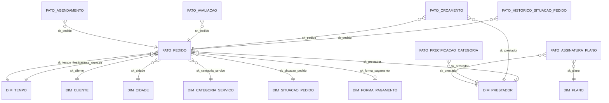
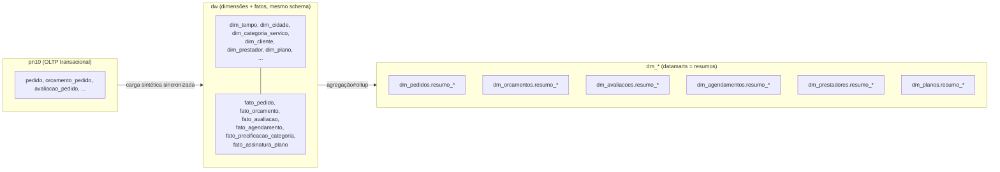

# Data Warehouse — Prestador Nota 10

Modelagem dimensional (estrela) e datamarts por assunto para a plataforma
**Prestador Nota 10** (marketplace de prestadores de serviço), construída a
partir da análise do domínio de negócio do projeto `api` (código-fonte da
API, removido deste workspace após a análise — usado apenas como referência)
e implementada sobre o banco PostgreSQL local `prestadornota10local`
(`jdbc:postgresql://localhost:5433/prestadornota10local`).

## 1. Análise de domínio (fonte: código da API)

A API (`com.opzz.prestadornota10`) implementa um marketplace onde:

- **Usuário** (`usuario`) pode ser `CLIENTE` (contrata serviços) ou
  `PRESTADOR` (presta serviços, associado a um `plano` comercial), sempre
  vinculado a uma `Pessoa` (PF) ou `Empresa` (PJ).
- O **Cliente** cria um **Pedido** (`pedido`) descrevendo o serviço desejado,
  associado a uma ou mais **Categorias de Serviço** (`categoria_servico`,
  hierarquia categoria → subcategoria) e a um endereço de atendimento
  (cidade/geolocalização).
- **Prestadores** enviam **Orçamentos** (`orcamento_pedido`) para o pedido; o
  cliente aceita um deles (`codigo_orcamento_selecionado`).
- O pedido evolui por um fluxo de situações (enum `SituacaoPedido`):
  `AGUARDANDO_ORCAMENTO → AGUARDANDO_AGENDAMENTO → AGUARDANDO_ATENDIMENTO →
  FINALIZADO_AGUARDANDO_AVALIACAO → FINALIZADO`, podendo ser `CANCELADO` em
  qualquer etapa. Cada transição é registrada em `historico_situacao_pedido`.
- Após o orçamento ser aceito, é criado um **Agendamento** (`agendamento`),
  vinculado à **Agenda** do prestador.
- Ao finalizar o serviço, o cliente registra uma **Avaliação**
  (`avaliacao_pedido`, nota 1–5), 1:1 com o pedido.
- Prestadores possuem **precificação por categoria**
  (`categoria_servico_prestador`) e assinam um **Plano** comercial
  (`plano`, limite de clientes/mês), controlado por integrações de
  pagamento (Hotmart/Monetizze/Eduzz).
- Existe também um fluxo alternativo de **Pedido Fixo** (preço fechado,
  prestadores concorrem por convite) — fora do escopo deste DW (ver seção 6).

Enums de negócio mapeados para dimensões: `SituacaoPedido`,
`SituacaoOrcamento`, `FormaPagamento` (`PIX`, `CARTAO`, `DINHEIRO`).

No ambiente local, as tabelas transacionais (`pedido`, `orcamento_pedido`,
`avaliacao_pedido`, `agendamento`, `pessoa`, `empresa`, `usuario`, `plano`)
estavam **vazias** — só havia dados de referência (cidade, estado,
categoria_servico, bancos, permissões). Por isso o DW foi **populado com
dados sintéticos**, gerados via PL/pgSQL respeitando as regras de negócio
acima (fluxo de situações, relação 1 pedido → N orçamentos → 1 selecionado,
1 pedido → 0/1 avaliação, etc.), enquanto os dados mestres reais
(cidade/estado/categoria_servico) foram reaproveitados como estão.

O mesmo conjunto sintético (mesmos nomes, cidades, situações, valores,
notas e datas) também foi replicado nas tabelas **transacionais do OLTP**
(`pn10.pessoa/empresa/contato/endereco/usuario/agenda/pedido/
orcamento_pedido/historico_situacao_pedido/agendamento/avaliacao_pedido/
plano/categoria_servico_prestador`), para que a API e o DW fiquem
sincronizados — ver `01_oltp_ddl.sql` e `02_oltp_carga.sql` na seção 4.

## 2. Arquitetura do DW

O pipeline segue três camadas, nesta ordem:

```
Banco transacional (OLTP)  →  DW (dimensões + fatos, mesmo schema)  →  Datamart (resumos do fato)
```

**Mudança de arquitetura em relação à primeira versão:** antes, o schema
`dw` continha só as dimensões conformadas e cada datamart (`dm_*`) guardava
sua própria cópia das tabelas fato. Agora as tabelas **fato ficam no mesmo
schema `dw` das dimensões** (esquema estrela convencional, único), e os
schemas `dm_*` passam a conter apenas **tabelas de resumo/agregação**
(rollups) construídas a partir dos fatos do `dw` — não há mais grão fino
nos datamarts.

| Schema | Papel | Conteúdo |
|---|---|---|
| `dw` | Data Warehouse | Todas as dimensões (`dim_*`) e todos os fatos (`fato_*`) |
| `dm_pedidos` | Datamart | Resumos de `dw.fato_pedido` |
| `dm_orcamentos` | Datamart | Resumos de `dw.fato_orcamento` |
| `dm_avaliacoes` | Datamart | Resumos de `dw.fato_avaliacao` |
| `dm_agendamentos` | Datamart | Resumos de `dw.fato_agendamento` |
| `dm_prestadores` | Datamart | Resumos de `dw.fato_precificacao_categoria` / `dw.dim_prestador` |
| `dm_planos` | Datamart | Resumos de `dw.fato_assinatura_plano` |

### Diagrama do DW (fato + dimensões no mesmo schema)


```mermaid
erDiagram
    FATO_PEDIDO }o--|| DIM_TEMPO : sk_tempo_abertura
    FATO_PEDIDO }o--|| DIM_TEMPO : sk_tempo_finalizacao
    FATO_PEDIDO }o--|| DIM_CLIENTE : sk_cliente
    FATO_PEDIDO }o--o| DIM_PRESTADOR : sk_prestador
    FATO_PEDIDO }o--|| DIM_CIDADE : sk_cidade
    FATO_PEDIDO }o--|| DIM_CATEGORIA_SERVICO : sk_categoria_servico
    FATO_PEDIDO }o--|| DIM_SITUACAO_PEDIDO : sk_situacao_pedido
    FATO_PEDIDO }o--o| DIM_FORMA_PAGAMENTO : sk_forma_pagamento
    FATO_HISTORICO_SITUACAO_PEDIDO }o--|| FATO_PEDIDO : sk_pedido
    FATO_ORCAMENTO }o--|| FATO_PEDIDO : sk_pedido
    FATO_ORCAMENTO }o--|| DIM_PRESTADOR : sk_prestador
    FATO_AVALIACAO }o--|| FATO_PEDIDO : sk_pedido
    FATO_AGENDAMENTO }o--|| FATO_PEDIDO : sk_pedido
    FATO_PRECIFICACAO_CATEGORIA }o--|| DIM_PRESTADOR : sk_prestador
    FATO_ASSINATURA_PLANO }o--|| DIM_PRESTADOR : sk_prestador
    FATO_ASSINATURA_PLANO }o--|| DIM_PLANO : sk_plano
```

### Diagrama geral do pipeline


```mermaid
flowchart LR
    subgraph OLTP ["pn10 (OLTP transacional)"]
        T[pedido, orcamento_pedido, avaliacao_pedido, ...]
    end
    subgraph DW ["dw (dimensões + fatos, mesmo schema)"]
        DIM[dim_tempo, dim_cidade, dim_categoria_servico,\ndim_cliente, dim_prestador, dim_plano, ...]
        FATO[fato_pedido, fato_orcamento, fato_avaliacao,\nfato_agendamento, fato_precificacao_categoria,\nfato_assinatura_plano]
    end
    subgraph DM ["dm_* (datamarts = resumos)"]
        RP[dm_pedidos.resumo_*]
        RO[dm_orcamentos.resumo_*]
        RA[dm_avaliacoes.resumo_*]
        RAg[dm_agendamentos.resumo_*]
        RPr[dm_prestadores.resumo_*]
        RPl[dm_planos.resumo_*]
    end
    OLTP -->|carga sintética sincronizada| DW
    DIM --- FATO
    DW -->|agregação/rollup| DM
```

## 3. Grão das tabelas fato (schema `dw`)

| Tabela | Grão |
|---|---|
| `dw.fato_pedido` | 1 linha por pedido |
| `dw.fato_historico_situacao_pedido` | 1 linha por transição de situação do pedido |
| `dw.fato_orcamento` | 1 linha por orçamento enviado por um prestador |
| `dw.fato_avaliacao` | 1 linha por avaliação de pedido finalizado |
| `dw.fato_agendamento` | 1 linha por agendamento de atendimento |
| `dw.fato_precificacao_categoria` | 1 linha por (prestador, categoria de serviço atendida) |
| `dw.fato_assinatura_plano` | 1 linha por prestador (snapshot do plano vigente) |

### Grão das tabelas de resumo (datamarts)

| Tabela | Grão |
|---|---|
| `dm_pedidos.resumo_pedido_mes_categoria` | 1 linha por (ano, mês, categoria de serviço, situação) |
| `dm_pedidos.resumo_pedido_regiao` | 1 linha por região geográfica |
| `dm_orcamentos.resumo_orcamento_prestador` | 1 linha por prestador |
| `dm_orcamentos.resumo_orcamento_categoria` | 1 linha por categoria de serviço |
| `dm_avaliacoes.resumo_avaliacao_categoria` | 1 linha por categoria de serviço |
| `dm_avaliacoes.resumo_avaliacao_prestador` | 1 linha por prestador |
| `dm_agendamentos.resumo_agendamento_mes` | 1 linha por (ano, mês) |
| `dm_agendamentos.resumo_agendamento_prestador` | 1 linha por prestador |
| `dm_prestadores.resumo_prestador_categoria` | 1 linha por categoria de serviço |
| `dm_prestadores.resumo_prestador_regiao` | 1 linha por região geográfica |
| `dm_planos.resumo_plano` | 1 linha por plano comercial |

## 4. Scripts (executar em ordem)

| Ordem | Arquivo | Camada | Conteúdo |
|---|---|---|---|
| 1 | `01_oltp_ddl.sql` | Banco transacional | DDL completo do OLTP (todas as migrações Flyway `V001`–`V059` + dados dev); cria o schema `pn10` |
| 2 | `02_oltp_carga.sql` | Banco transacional | Carga sintética do OLTP em **INSERTs SQL puros** |
| 3 | `03_dw_ddl.sql` | DW | Cria o schema único `dw` com **todas as dimensões e todos os fatos juntos** |
| 4 | `04_dw_carga.sql` | DW | Popula as dimensões e os fatos respeitando regras de negócio e transições |
| 5 | `05_datamart_ddl.sql` | Datamart | Cria os 6 schemas `dm_*`, cada um só com tabelas de **resumo/agregação** |
| 6 | `06_datamart_carga.sql` | Datamart | ETL de agregação: `INSERT INTO ... SELECT ... GROUP BY` a partir de `dw.fato_*`/`dw.dim_*` |
| 7 | `07_indices_dw.sql` | Otimização DW | Índices `B-Tree` e `BRIN` nas FKs e colunas analíticas das fatos para alta performance |
| 8 | `08_data_quality_tests.sql` | Testes / Qualidade | Testes automatizados de integridade referencial, temporal e regras de negócio |
| 9 | `09_segmentacao_clientes_ddl.sql` | Mineração | Cria `dw.dim_cliente_segmento` (destino da clusterização de clientes), populada por `mining/clusterizacao/segmentar_clientes.py` |

### Como executar o Pipeline

Você pode executar o pipeline completo de ponta a ponta com um único comando:

**No Windows (PowerShell):**
```powershell
.\executar_pipeline.ps1
```

**No Linux/macOS (Bash):**
```bash
chmod +x executar_pipeline.sh
./executar_pipeline.sh
```

---

## 5. Ensemble: Clusterização de Clientes + Regras de Associação (`mining/`)

Esta é a entrega central da tarefa ("Ensemble: clusterização de clientes com
Regras de Associação"): os clientes são primeiro segmentados por
comportamento de compra e, **só depois, as Regras de Associação são
mineradas separadamente dentro de cada segmento** — em vez de uma lista
genérica de regras para toda a base. Relatório técnico completo (metodologia,
resultados, limitações):
[`mining/RELATORIO_TECNICO.md`](mining/RELATORIO_TECNICO.md).

Setup do ambiente Python (uma vez):
```bash
cd mining
python3 -m venv .venv && source .venv/bin/activate
pip install -r requirements.txt
cd ..
```
Os comandos abaixo devem ser executados a partir da **raiz do repositório**
(com o venv ativado).

### 5.1 Clusterização de Clientes (`mining/clusterizacao/`)

- **Algoritmo**: `K-Means`, com seleção de `k` por `Silhouette Score` (testado `k = 2..8`).
- **Features**: RFM (frequência, valor, recência) + diversidade de categorias + taxa de cancelamento + nota média + tipo de pessoa + região.
- **Saída**: grava o cluster de cada cliente em `dw.dim_cliente_segmento` (consumida pela etapa de associação) e em `mining/clusterizacao/clientes_segmentados.csv`; gera `relatorio_clusterizacao.md` e `elbow_silhouette.png`.
- **Execução**:
  ```bash
  psql ... -f dw/09_segmentacao_clientes_ddl.sql   # uma vez, cria a tabela
  python3 mining/clusterizacao/segmentar_clientes.py
  ```

### 5.2 Regras de Associação por segmento (`mining/associacao/`)

- **Algoritmos**: `FP-Growth` e `Apriori` (via biblioteca `mlxtend`), executados **uma vez por segmento de cliente**.
- **Item da cesta**: macro categoria de serviço (rollup das subcategorias finas, necessário para suporte estatístico).
- **Métricas calculadas**: Suporte, Confiança, Lift, Alavancagem e Convicção.
- **Execução**:
  ```bash
  python3 mining/associacao/regras_associacao.py
  ```
- Saída consolidada: `mining/associacao/regras_descobertas.csv` (coluna `Segmento`) e `relatorio_regras.md` (uma seção por segmento).
- **Notebook de referência (versão não segmentada, mantida para fins didáticos)**: [`mining/associacao/regras_associacao.ipynb`](mining/associacao/regras_associacao.ipynb)

---

## 6. Módulo complementar: Ensemble de Classificadores para Churn (`mining/ensemble/`)

**Não é o "ensemble" pedido no enunciado** (que é a combinação clusterização +
regras de associação da seção 5) — é uma análise supervisionada adicional,
mantida por agregar valor próprio: antecipar o **cancelamento de pedidos**
combinando vários classificadores (ensemble de modelos, no sentido de
bagging/boosting/stacking).

- **Modelos Implementados**:
  - *Random Forest* (Bagging)
  - *Gradient Boosting* & *AdaBoost* (Boosting)
  - *Voting Classifier* (Ensemble por votação ponderada)
  - *Stacking Classifier* (Meta-modelo com regressão logística)
- **Métricas avaliadas**: ROC-AUC, F1-Score, Acurácia, Precisão, Recall e Feature Importances.
- **Execução**:
  ```bash
  python3 mining/ensemble/treinar_ensemble.py
  ```
- **Notebook interativo**: [`mining/ensemble/ensemble_learning.ipynb`](mining/ensemble/ensemble_learning.ipynb)
- Resultado nos dados reais do DW: ROC-AUC ~0,53–0,58 (ver limitações no [relatório técnico](mining/RELATORIO_TECNICO.md), seção 6).

---

## 7. Exemplos de consultas analíticas

```sql
-- Direto no DW (join fato + dimensões)
select sit.situacao, count(*)
from dw.fato_pedido fp
join dw.dim_situacao_pedido sit on sit.sk_situacao_pedido = fp.sk_situacao_pedido
group by sit.situacao order by 2 desc;

-- Direto no datamart (já é um resumo, sem necessidade de join)
select * from dm_pedidos.resumo_pedido_regiao order by qtd_pedidos desc;

-- Funil de Conversão analítico (Metabase View)
select * from dm_pedidos.vw_funil_pedidos;

-- Visão 360 do Prestador (Metabase View)
select * from dm_prestadores.vw_performance_prestador_360 order by orcamentos_ganhos desc;
```

---

## 8. Metabase (visualização dos datamarts e views analíticas)

O diretório [`metabase/`](metabase) sobe um container do Metabase (via `docker compose`) já conectado ao Postgres do projeto.

### Provisionamento Automatizado:
- **Windows (PowerShell)**: `.\metabase\setup_metabase.ps1`
- **Linux/macOS (Bash)**: `./metabase/setup_metabase.sh`
- Acesse **http://localhost:3000** (Login: `admin@pn10.local` / `Pn10Metabase!2026`).
- `metabase/views/vw_segmentacao_clientes.sql` expõe `dw.vw_segmentacao_clientes`
  (1 linha por cliente segmentado) e `dw.vw_resumo_segmento_cliente` (perfil médio
  por cluster) — populadas após rodar a clusterização da seção 5.1. Após criar a
  view/popular a tabela, force uma sincronização de schema (ver
  [`metabase/README.md`](metabase/README.md#re-sincronizar-o-schema)).

---

## 9. Fluxo de contribuição

A branch `main` **não deve receber push direto** — todas as mudanças devem ser propostas em uma branch de trabalho (ex.: `branch_ivanio_pn_10_dataware`) e integradas via Pull Request.


