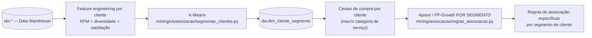

# Relatório Técnico — Ensemble: Clusterização de Clientes + Regras de Associação

**Projeto:** Prestador Nota 10 — Data Warehouse → Datamart → Mineração de Dados
**Disciplina:** Tópicos Avançados em Inteligência Artificial I (IFG)
**Tarefa:** Ensemble — clusterização de clientes com Regras de Associação

## 1. Objetivo

Combinar duas técnicas de aprendizado em um único pipeline (ensemble, no sentido
de *aprendizagem por conjuntos de técnicas*) para análise de CRM/marketing:

1. **Segmentar os clientes** da plataforma via clusterização não supervisionada,
   a partir do seu comportamento de compra registrado no DW.
2. **Minerar Regras de Associação entre categorias de serviço contratadas,
   separadamente para cada segmento**, em vez de aplicar as regras na base
   inteira (o que geraria regras genéricas e pouco acionáveis).

Fonte dos dados: schema `dw` do Data Warehouse (`dw.fato_pedido`, `dw.dim_cliente`,
`dw.dim_categoria_servico`, `dw.dim_cidade`, `dw.dim_tempo`), populado por
`dw/01..08_*.sql` (ver [README.md](../README.md)).

## 2. Arquitetura do pipeline implementado



Os dois scripts se comunicam através da tabela `dw.dim_cliente_segmento`
(criada por `dw/09_segmentacao_clientes_ddl.sql`): o módulo de clusterização
grava o cluster de cada cliente nessa tabela; o módulo de regras de
associação faz `LEFT JOIN` com ela para montar as cestas **já filtradas por
segmento**.

Um terceiro módulo pré-existente (`mining/ensemble/treinar_ensemble.py`) foi
mantido e corrigido nesta branch; ele resolve um problema diferente e
complementar — **classificação supervisionada de cancelamento de pedido**
(ensemble de classificadores: Random Forest, Gradient Boosting, AdaBoost,
Voting, Stacking) — e não deve ser confundido com o "ensemble" exigido pelo
enunciado (que é a combinação clusterização → regras de associação descrita
acima). Ele é discutido na seção 6 como análise complementar.

## 3. Etapa 1 — Clusterização de clientes (`mining/clusterizacao/`)

### 3.1 Features (por cliente, agregadas de `dw.fato_pedido`)

| Feature | Tipo | Descrição |
|---|---|---|
| `qtd_pedidos` | numérica (Frequência) | nº de pedidos abertos pelo cliente |
| `valor_total` | numérica (Monetário) | soma do valor do orçamento selecionado |
| `valor_medio_pedido` | numérica | ticket médio |
| `qtd_categorias_distintas` | numérica | diversidade de categorias de serviço contratadas |
| `taxa_cancelamento` | numérica | % de pedidos cancelados |
| `nota_media` | numérica | nota média dada nas avaliações |
| `recencia_dias` | numérica (Recência) | dias desde o último pedido |
| `tipo_pessoa` | categórica | PF/PJ |
| `regiao` | categórica | região da cidade do cliente |

Numéricas padronizadas com `StandardScaler`; categóricas com `OneHotEncoder`
(`ColumnTransformer`). Apenas clientes com **ao menos 1 pedido** entram no
modelo (277 dos 300 clientes cadastrados) — clientes sem pedido não têm cesta
de compra para a etapa seguinte.

### 3.2 Escolha do algoritmo e de k

Algoritmo: **K-Means**. Seleção de `k` testando `k = 2..8` e escolhendo o
maior **Silhouette Score** (ver `mining/clusterizacao/comparativo_k.csv` e
`elbow_silhouette.png`):

| k | inertia | silhouette |
|---|---|---|
| 2 | 1625.07 | **0.217** (escolhido) |
| 3 | 1424.65 | 0.170 |
| 4 | 1273.95 | 0.176 |
| 5 | 1127.95 | 0.181 |
| 6 | 1026.39 | 0.187 |
| 7 | 942.05 | 0.184 |
| 8 | 895.50 | 0.171 |

**k = 2** foi o escolhido. O Silhouette Score máximo (0.217) é **baixo**
(valores > 0.5 indicam clusters bem separados) — ver limitações na seção 5.

### 3.3 Perfil dos clusters encontrados

| Cluster | Clientes | Pedidos (méd.) | Valor total (méd.) | Categorias distintas (méd.) | Cancelamento | Nota média | Recência (dias) | Rótulo de negócio |
|---|---|---|---|---|---|---|---|---|
| 0 | 154 | 1.80 | R$ 803,69 | 1.78 | 19% | 4.24 | 813 | **Inativos / Baixo Engajamento** |
| 1 | 123 | 4.25 | R$ 2.186,42 | 4.17 | 16% | 4.09 | 395 | **Clientes Fiéis / Alto Valor** |

O resultado é gravado em `dw.dim_cliente_segmento` (Postgres, consumido pela
etapa 2) e em `mining/clusterizacao/clientes_segmentados.csv`.

## 4. Etapa 2 — Regras de Associação por segmento (`mining/associacao/`)

### 4.1 Definição de "cesta de compras" e "produto"

O domínio é um marketplace de serviços, não varejo: não há SKU de produto.
O **item da cesta** adotado é a **macro categoria de serviço**
(`dim_categoria_servico.descricao_categoria_pai`, ~25 valores), obtida por
*rollup* das ~130 subcategorias finas — necessário porque, no grão fino, a
base (800 pedidos / 277 clientes ≈ 2,9 pedidos/cliente) é esparsa demais para
produzir qualquer regra com suporte estatístico. A cesta de um cliente é o
conjunto de macro categorias distintas que ele já contratou.

### 4.2 Algoritmo

**FP-Growth** (`mlxtend`), com geração de regras por `lift`. Suporte mínimo
inicial de 8%, com **fallback automático** para 6% → 4,5% → 3% → 2% quando o
segmento não produz itemsets no suporte maior (implementado para lidar com
segmentos menores sem exigir ajuste manual a cada execução).

### 4.3 Resultado por segmento

**Segmento "Clientes Fiéis / Alto Valor" (123 clientes, suporte mínimo 8%)** — 8 regras encontradas, destaques:

| Se contratou | Também contrata | Suporte | Confiança | Lift |
|---|---|---|---|---|
| Chaveiros e ferragens | Hidráulica | 10.57% | 52.00% | 1.39 |
| Chaveiros e ferragens | Residencial | 9.76% | 48.00% | 1.18 |
| Automotivo | Computadores, Celulares e Tecnologia | 8.13% | 22.73% | 1.17 |
| Hidráulica | Residencial | 17.07% | 45.65% | 1.12 |

**Segmento "Inativos / Baixo Engajamento" (154 clientes)** — nenhum itemset
frequente encontrado mesmo após reduzir o suporte até 2%. Interpretação: é um
grupo de clientes com poucos pedidos (média 1,8) e baixa diversidade de
categorias (média 1,78) — portanto poucas cestas com 2+ itens, insuficiente
para regras de associação confiáveis. Isso é, em si, um achado de negócio
(ver seção 5).

Saídas: `mining/associacao/regras_descobertas.csv` (consolidado, coluna
`Segmento`) e `mining/associacao/relatorio_regras.md` (uma seção por
segmento).

### 4.4 Valor da segmentação (comparação)

Rodar Apriori/FP-Growth na base inteira (sem segmentar) mistura os dois
perfis e tende a diluir regras que só existem no grupo de clientes fiéis —
é exatamente o problema que o enunciado pede para evitar. Ao segmentar
primeiro, a regra "Chaveiros e ferragens → Hidráulica" (lift 1,39) só aparece
como estatisticamente relevante dentro do segmento "Clientes Fiéis / Alto
Valor"; no segmento inativo ela nem chega a ter suporte suficiente para ser
testada.

## 5. Limitações e riscos (importantes para a defesa do trabalho)

- **Base pequena/esparsa para regras de associação**: 800 pedidos para 277
  clientes ativos (~2,9 pedidos/cliente) é pouco para Market Basket Analysis
  clássico. Os valores de suporte e lift encontrados são estatisticamente
  fracos (lift máximo 1,39) e devem ser lidos como **prova de conceito do
  pipeline**, não como regras de negócio definitivas.
- **Silhouette Score baixo (0,217)**: os clusters existem mas não são
  fortemente separados — o que é esperado em dados majoritariamente
  sintéticos (ver `dw/README.md` seção 1) sem uma estrutura de segmentação
  de clientes deliberadamente embutida na geração dos dados.
- **Dados do DW são sintéticos** (ver `dw/README.md`): os padrões de compra
  e cancelamento não seguem necessariamente uma lógica de negócio real, o
  que também explica o desempenho fraco do módulo de classificação de churn
  (seção 6). Em dados reais de produção, tanto os clusters quanto as regras
  tendem a ficar mais nítidos.
- **Rollup para macro categoria**: necessário para viabilizar suporte
  estatístico, mas reduz a granularidade do insight (não diferencia, por
  exemplo, "Instalação de Ar Condicionado" de "Manutenção de Ar
  Condicionado" dentro da macro categoria "Climatização").

## 6. Módulo complementar: Ensemble de Classificadores (`mining/ensemble/`)

Pré-existente no projeto (branch `branch_ivaniojr_pn_10_dataware`), este
módulo resolve um problema supervisionado diferente — prever
`indicador_cancelado` do pedido com Random Forest, Gradient Boosting,
AdaBoost, Voting e Stacking — e foi **corrigido nesta branch** (bug de driver
SQLAlchemy, ver seção 7) para rodar contra os dados reais do DW em vez do
fallback sintético embutido no script.

Resultado real (antes mascarado pelo fallback sintético, que tinha uma
relação logística artificial entre features e o alvo):

| Modelo | ROC-AUC (teste) |
|---|---|
| Gradient Boosting | **0,583** (melhor) |
| Voting Ensemble | 0,572 |
| Stacking Ensemble | 0,577 |
| Random Forest | 0,533 |
| AdaBoost | 0,531 |

Um ROC-AUC próximo de 0,5 indica que, **nos dados reais do DW**, o
cancelamento do pedido não é bem explicado pelas features atuais
(`qtd_orcamentos_recebidos`, `dias_para_primeiro_orcamento`,
`valor_orcamento`, `avaliacao_prestador`, etc.) — ao contrário do relatório
anterior (commit do PR #2), que reportava ROC-AUC de até 0,835 porque os
scripts, sem a correção de conectividade, caíam no gerador sintético
embutido (com uma relação logística artificialmente forte entre
`dias_para_primeiro_orcamento`/`qtd_orcamentos_recebidos` e o cancelamento).
Isso é documentado aqui por transparência metodológica.

## 7. Correções técnicas realizadas nesta branch

1. **Bug de conectividade SQLAlchemy → Postgres**: a string de conexão
   `postgresql://...` (sem driver explícito) fazia o SQLAlchemy 2.1 tentar o
   dialeto `psycopg` (v3, não instalado) em vez de `psycopg2` (instalado),
   lançando exceção silenciosamente capturada pelo `try/except` dos scripts —
   fazendo-os cair no fallback sintético **sem nunca tocar o banco real**.
   Confirmado comparando categorias de serviço fictícias do CSV commitado
   (ex. "Reparo de Telhado", "Consultoria Técnica") com as categorias reais
   do DW (nenhuma coincide). Corrigido trocando o default para
   `postgresql+psycopg2://...` em `regras_associacao.py` e
   `treinar_ensemble.py`.
2. **Ambiente Python inexistente**: criado `mining/.venv` +
   `pip install -r mining/requirements.txt` (adicionado ao `.gitignore`).
3. **Bug de path relativo**: ao rodar os scripts a partir de subpastas, o
   `output_dir` relativo (`"mining/associacao"`, etc.) resolvia para
   diretórios aninhados (`mining/mining/...`). Os scripts devem ser
   executados a partir da raiz do repositório (documentado no
   `README.md`/pipeline).
4. **Correção de formatação** de suporte/confiança (%) no relatório
   consolidado por segmento.

## 8. Conclusões e recomendações de negócio

1. **Clientes Fiéis / Alto Valor** (123 clientes): maior ticket médio e maior
   diversidade de categorias. Ação recomendada: cross-sell orientado pelas
   regras encontradas (ex. oferecer "Hidráulica" a quem contratou "Chaveiros
   e ferragens") e programa de fidelidade.
2. **Inativos / Baixo Engajamento** (154 clientes): maioria da base, poucos
   pedidos e sem regras de associação estatisticamente confiáveis. Ação
   recomendada: campanhas de reativação/cupom — e não cross-sell baseado em
   regras (dados insuficientes para esse grupo).
3. **Próximos passos técnicos** para fortalecer o pipeline: (a) aumentar o
   volume de pedidos por cliente na carga sintética do DW para reduzir a
   esparsidade; (b) reavaliar `k` à medida que novos dados chegarem; (c)
   revisitar as features de churn do módulo de classificação (seção 6), já
   que o conjunto atual não discrimina bem o cancelamento nos dados reais.

## 9. Como reproduzir

```bash
cd mining
python3 -m venv .venv && source .venv/bin/activate
pip install -r requirements.txt
cd ..
psql ... -f dw/09_segmentacao_clientes_ddl.sql   # cria dw.dim_cliente_segmento (se ainda não existir)
python3 mining/clusterizacao/segmentar_clientes.py   # Etapa 1: clusteriza clientes
python3 mining/associacao/regras_associacao.py       # Etapa 2: regras de associação por segmento
python3 mining/ensemble/treinar_ensemble.py          # módulo complementar (classificação de churn)
```

Todos os comandos devem ser executados a partir da **raiz do repositório**.
